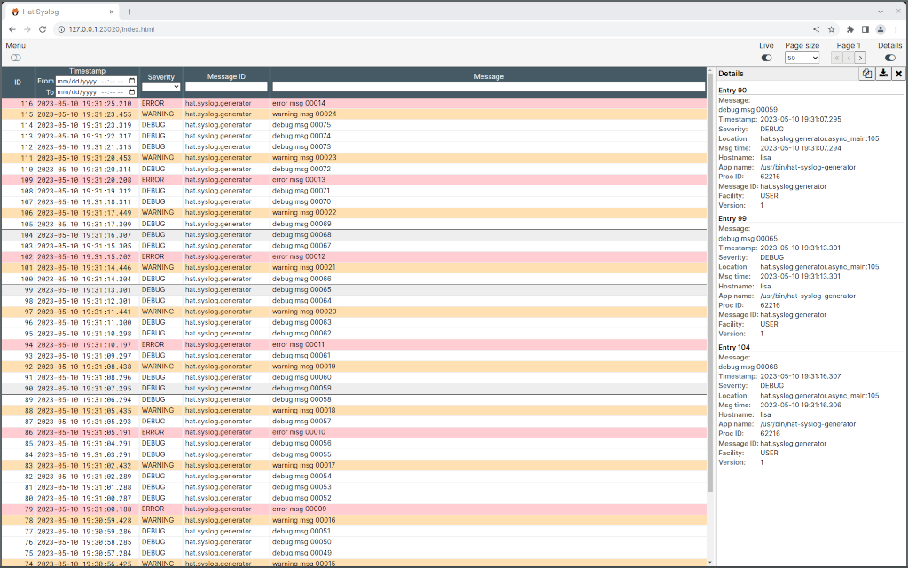

.. _Syslog Server: docs/server.rst
.. _Syslog Handler: docs/handler.rst
.. _Syslog Generator: docs/generator.rst

.. _Končar Digital: https://www.koncar.hr

.. _hat-syslog documentation: https://hat-syslog.hat-open.com
.. _hat-syslog git repository: https://github.com/hat-open/hat-syslog.git
.. _Hat Open homepage: https://hat-open.com

.. _RFC 5425: https://tools.ietf.org/html/rfc5425
.. _RFC 5426: https://tools.ietf.org/html/rfc5426
.. _RFC 6587: https://tools.ietf.org/html/rfc6587

.. _AUR package: https://aur.archlinux.org/packages/hat-syslog
.. _GutHub releases: https://github.com/hat-open/hat-syslog/releases
.. _PyPI project: https://pypi.org/project/hat-syslog

hat-syslog - Syslog server and clients
======================================

This component is part of Hat Open project - open-source framework of tools and
libraries for developing applications used for remote monitoring, control and
management of intelligent electronic devices such as IoT devices, PLCs,
industrial automation or home automation systems.

Development of Hat Open and associated repositories is sponsored by
`Končar Digital`_.

For more information see:

    * `hat-syslog documentation`_
    * `hat-syslog git repository`_
    * `Hat Open homepage`_

.. warning::

    This project is currently in state of active development. Features,
    functionality and API are unstable.

About
-----

`hat-syslog` provides server/client tooling based on Syslog logging protocol
as defined by `RFC 5425`_, `RFC 5426`_ and `RFC 6587`_.

This project includes implementations of:

    * `Syslog Server`_
    * `Syslog Handler`_
    * `Syslog Generator`_

Syslog Server
'''''''''''''

Central concentrator for syslog messages with web interface for real time
monitoring and filtering of log messages.

|syslog-server-img|

Syslog Handler
''''''''''''''

Implementation of Python's standard library `logging.Handler` based on
dedicated background logging thread.

Syslog Generator
''''''''''''''''

Simple testing tool responsible for generating syslog messages.

Runtime requirements
--------------------

* python >=3.8

Install
-------

Archlinux
'''''''''

`hat-syslog` is available as `AUR package`_::

    $ yay -S hat-syslog

Windows
'''''''

Windows distribution, with embedded python, is available at `GutHub releases`_.

Python wheel
''''''''''''

`hat-syslog` is available as `PyPI project`_::

    $ pip install hat-syslog

Usage
-----

Syslog Server
'''''''''''''

Command `hat-syslog-server` is used for running new Syslog Server instance::

    $ hat-syslog-server

For additional details and command line options see `Syslog Server`_.

Syslog Handler
''''''''''''''

Example python logging configuration:

.. code:: python

    import logging.conf

    logging.config.dictConfig({
        'version': 1,
        'formatters': {
            'default': {}},
        'handlers': {
            'syslog': {
                'class': 'hat.syslog.handler.SyslogHandler',
                'host': '127.0.0.1',
                'port': 6514,
                'comm_type': 'TCP',
                'level': 'DEBUG',
                'formatter': 'default'}},
        'root': {
            'level': 'INFO',
            'handlers': ['syslog']},
        'disable_existing_loggers': False})

For additional details see `Syslog Handler`_.

Syslog Generator
''''''''''''''''

Command `hat-syslog-generator` is used for running Syslog Generator::

    $ hat-syslog-generator

For additional details and command line options see `Syslog Generator`_.

License
-------

Copyright 2020-2023 Hat Open AUTHORS

Licensed under the Apache License, Version 2.0 (the "License");
you may not use this file except in compliance with the License.
You may obtain a copy of the License at

    http://www.apache.org/licenses/LICENSE-2.0

Unless required by applicable law or agreed to in writing, software
distributed under the License is distributed on an "AS IS" BASIS,
WITHOUT WARRANTIES OR CONDITIONS OF ANY KIND, either express or implied.
See the License for the specific language governing permissions and
limitations under the License.
